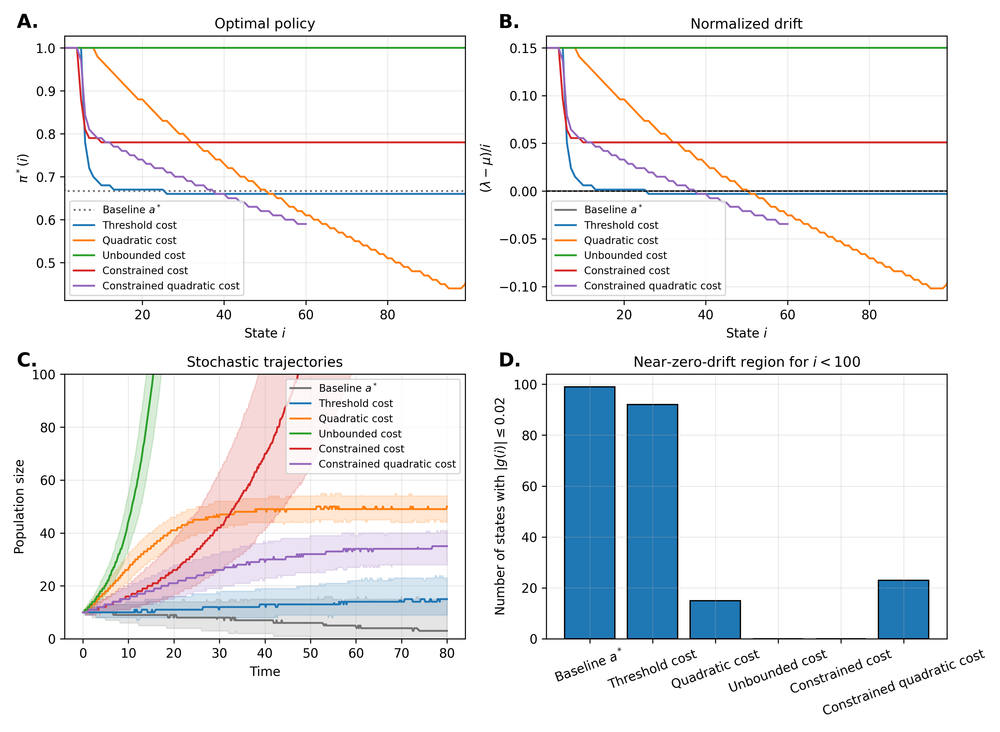
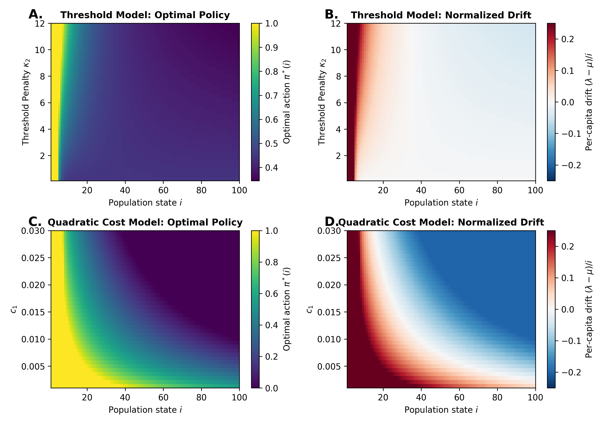
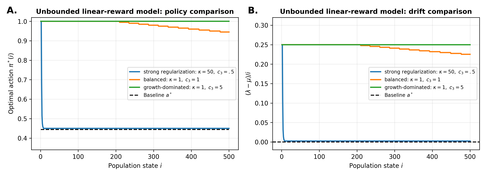
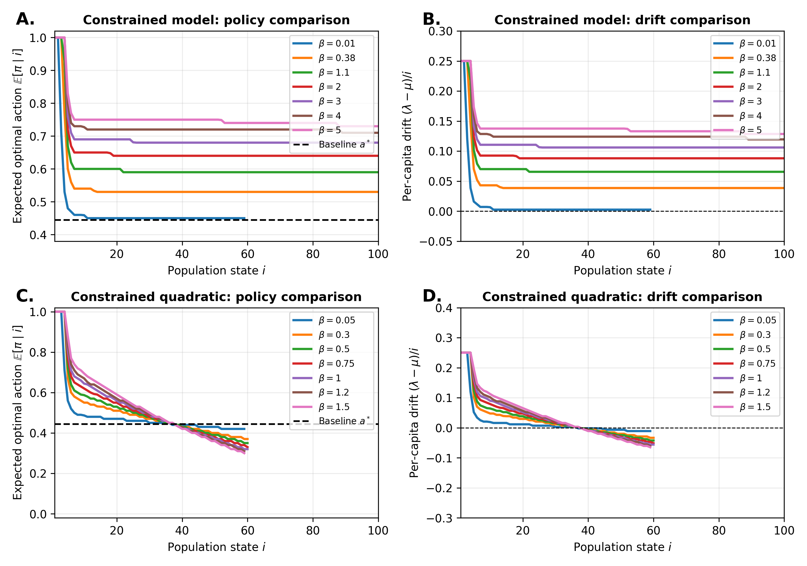

# Apoptotic control figures

Code for the main-text and supplementary figures in *Apoptotic Control*.

## Setup

```bash
conda env create -f environment.yml
conda activate apoptotic-control-figures
python -m pip install -e .
```

The same environment can be installed with `requirements.txt` if conda is not
available.

## Generate figures

Each manuscript figure has its own script:

```bash
python scripts/main/figure_1.py
python scripts/si/figure_s5.py
```

To run every figure:

```bash
python scripts/make_all.py
```

The constrained models and convergence studies take longer. For a shorter test
run, use:

```bash
python scripts/make_all.py --quick
```

Final figures are written to `figures/main` and `figures/supplementary`. The
parameter values used in the paper are collected in
[`src/apoptotic_control/parameters.py`](src/apoptotic_control/parameters.py).

## Code

- `models.py`: CTMDP models and objective functions
- `solvers.py`: wrappers used by the figure scripts
- `analysis.py`: drift, occupancy support, and related calculations
- `simulation.py`: Gillespie simulations
- `plotting.py`: plotting functions shared across figures

The original working analysis is kept in
[`notebooks/original_analysis.ipynb`](notebooks/original_analysis.ipynb). The
numbered scripts above are the reproduction code for the paper.

## Main figures









Figures S1-S8 are in [`figures/supplementary`](figures/supplementary).

## Notes

- Simulations use fixed seeds.
- Constrained policies are shown only at states with non-negligible discounted
  occupancy.
- The extinction-state penalty is `P_ext = 10^4`.
- Figure 3 uses the 3,500 value-iteration updates used for the displayed panel.
- The constrained curve in Figure S8 starts from `i0 = 1`, as in the displayed
  panel.

## License

A license has not yet been selected.
